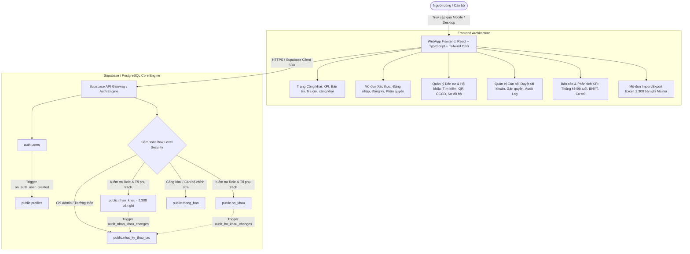

# Kế Hoạch Toàn Diện & Chặt Chẽ: Hệ Thống Quản Trị Dân Cư Số Thôn An Trạch (Supabase RLS & Mobile-First WebApp)

Tài liệu thiết kế kiến trúc kỹ thuật và kế hoạch triển khai toàn diện cho **Hệ thống Quản trị Dân cư Số Thôn An Trạch** (xã Hòa Tiến, huyện Hòa Vang, TP Đà Nẵng). Hệ thống quản lý **2.308 nhân khẩu** và toàn bộ hộ khẩu, bảo mật đa tầng bằng **PostgreSQL Row Level Security (RLS)**, tự động ghi vết thay đổi (**Audit Triggers**), tích hợp **quét mã QR CCCD** và **Import/Export Excel chuẩn hóa 2 chiều**.

---

## 1. Kiến Trúc Tổng Thể & Luồng Dữ Liệu (Architecture Overview)



---

## 2. Mô Hình Dữ Liệu Chi Tiết (Database Schema & DDL)

Cơ sở dữ liệu bao gồm 5 bảng chính và 2 view thống kê, chuẩn hóa từ 24 trường thông tin của file Master Excel `DuLieu_DanCu_AnTrach_DongBo_Master.xlsx`.

### 2.1. Bảng `profiles` (Hồ sơ Cán bộ & Quản trị)
```sql
CREATE TYPE user_role AS ENUM (
  'super_admin',      -- Quản trị viên tối cao
  'admin',            -- Quản trị viên hệ thống
  'truong_thon',      -- Trưởng thôn (Toàn quyền quản lý dân cư/hộ khẩu)
  'to_truong',        -- Tổ trưởng tổ dân cư (Phụ trách tổ 1 - 8)
  'can_bo_y_te',      -- Cán bộ y tế thôn/xã
  'cong_an_vien',     -- Công an viên phụ trách thôn
  'can_bo_xa'         -- Cán bộ UBND xã giám sát
);

CREATE TYPE user_status AS ENUM (
  'pending_approval', -- Đang chờ duyệt
  'active',           -- Đã kích hoạt
  'blocked'           -- Đang bị khóa
);

CREATE TABLE public.profiles (
  id UUID PRIMARY KEY REFERENCES auth.users(id) ON DELETE CASCADE,
  email TEXT NOT NULL UNIQUE,
  ho_ten TEXT NOT NULL,
  so_dien_thoai TEXT,
  vai_tro user_role NOT NULL DEFAULT 'to_truong',
  to_phu_trach TEXT NOT NULL DEFAULT 'Tổ 1', -- 'Toàn thôn', 'Tổ 1', 'Tổ 2', ..., 'Tổ 8'
  trang_thai user_status NOT NULL DEFAULT 'pending_approval',
  avatar_url TEXT,
  last_login TIMESTAMPTZ,
  created_at TIMESTAMPTZ NOT NULL DEFAULT timezone('utc'::text, now()),
  updated_at TIMESTAMPTZ NOT NULL DEFAULT timezone('utc'::text, now())
);
```

### 2.2. Bảng `ho_khau` (Sổ Hộ Khẩu Thôn An Trạch)
```sql
CREATE TABLE public.ho_khau (
  id UUID PRIMARY KEY DEFAULT gen_random_uuid(),
  ma_ho TEXT NOT NULL UNIQUE,                -- HK001, HK002,...
  chu_ho_id UUID,                            -- Khóa ngoại liên kết bảng nhan_khau (nếu có)
  ten_chu_ho TEXT NOT NULL,                  -- Tên chủ hộ
  so_cmnd_chu_ho TEXT,                       -- CCCD/CMND chủ hộ
  so_dien_thoai TEXT,                        -- Số điện thoại liên hệ
  dia_chi TEXT NOT NULL,                     -- Địa chỉ chi tiết
  to_dan_cu TEXT NOT NULL,                   -- Tổ 1 đến Tổ 8
  so_nhan_khau INTEGER NOT NULL DEFAULT 1,   -- Tổng số khẩu trong hộ
  ghi_chu TEXT,
  created_at TIMESTAMPTZ NOT NULL DEFAULT timezone('utc'::text, now()),
  updated_at TIMESTAMPTZ NOT NULL DEFAULT timezone('utc'::text, now()),
  updated_by UUID REFERENCES public.profiles(id)
);

CREATE INDEX idx_ho_khau_to ON public.ho_khau(to_dan_cu);
CREATE INDEX idx_ho_khau_ma_ho ON public.ho_khau(ma_ho);
```

### 2.3. Bảng `nhan_khau` (2.308 Hồ Sơ Nhân Khẩu Chi Tiết)
```sql
CREATE TABLE public.nhan_khau (
  id UUID PRIMARY KEY DEFAULT gen_random_uuid(),
  stt_excel INTEGER,                         -- STT gốc từ file Excel
  ma_ho TEXT NOT NULL,                       -- Mã hộ (HK001...)
  chu_ho TEXT NOT NULL,                      -- Tên chủ hộ
  quan_he_chu_ho TEXT NOT NULL,              -- Chủ hộ, Vợ, Con, Mẹ, Bố, Cháu...
  ho_ten TEXT NOT NULL,                      -- Họ và tên đầy đủ
  gioi_tinh TEXT NOT NULL,                   -- Nam / Nữ
  ngay_thang_nam_sinh TEXT,                  -- Định dạng DD/MM/YYYY
  nam_sinh INTEGER,                          -- Năm sinh (số nguyên để tính tuổi và lọc)
  tuoi INTEGER,                              -- Tuổi tính đến năm hiện tại
  nhom_tuoi TEXT,                            -- Trẻ em, Học sinh, Lao động trẻ, Trung niên, Cao tuổi...
  so_cmnd_cccd TEXT,                         -- Số CCCD 12 số hoặc CMND 9 số
  loai_giay_to TEXT,                         -- CCCD 12 số / CMND 9 số / Chưa có
  dien_thoai TEXT,                           -- Số điện thoại cá nhân
  ho_ten_cha TEXT,                           -- Họ tên bố
  ho_ten_me TEXT,                            -- Họ tên mẹ
  ma_the_bhyt TEXT,                          -- Mã thẻ BHYT (GD, TE, BT, DN,...)
  nhom_bhyt TEXT,                            -- GD - Hộ gia đình, TE - Trẻ em, BT - Bảo trợ...
  nghe_nghiep TEXT,                          -- Nghề nghiệp
  dia_chi TEXT NOT NULL,                     -- Địa chỉ thường trú
  to_dan_cu TEXT NOT NULL,                   -- Tổ 1, Tổ 2, ..., Tổ 8
  trang_thai_cu_tru TEXT NOT NULL DEFAULT 'Đang thường trú', -- Đang thường trú / Đã chuyển đi / Tạm vắng / Đã mất / Tạm trú
  doi_tuong_dac_thu TEXT DEFAULT 'Bình thường',             -- Bình thường / Hộ nghèo / Hộ cận nghèo / Người cao tuổi / Trẻ em...
  ghi_chu TEXT,                              -- Ghi chú bổ sung
  nguon_dong_bo TEXT,                        -- Khớp hoàn toàn / Chỉ có ở nguồn 1 / Nguồn 2
  search_tsv TSVECTOR,                       -- Full-text search vector tiếng Việt không dấu
  created_at TIMESTAMPTZ NOT NULL DEFAULT timezone('utc'::text, now()),
  updated_at TIMESTAMPTZ NOT NULL DEFAULT timezone('utc'::text, now()),
  updated_by UUID REFERENCES public.profiles(id)
);

CREATE INDEX idx_nhan_khau_ma_ho ON public.nhan_khau(ma_ho);
CREATE INDEX idx_nhan_khau_to ON public.nhan_khau(to_dan_cu);
CREATE INDEX idx_nhan_khau_cccd ON public.nhan_khau(so_cmnd_cccd);
CREATE INDEX idx_nhan_khau_bhyt ON public.nhan_khau(ma_the_bhyt);
CREATE INDEX idx_nhan_khau_cu_tru ON public.nhan_khau(trang_thai_cu_tru);
CREATE INDEX idx_nhan_khau_nam_sinh ON public.nhan_khau(nam_sinh);
```

### 2.4. Bảng `nhat_ky_thao_tac` (Audit Log Hệ Thống)
```sql
CREATE TABLE public.nhat_ky_thao_tac (
  id UUID PRIMARY KEY DEFAULT gen_random_uuid(),
  user_id UUID REFERENCES public.profiles(id),
  user_email TEXT,
  user_name TEXT,
  hanh_dong TEXT NOT NULL,     -- 'INSERT', 'UPDATE', 'DELETE', 'IMPORT_EXCEL', 'EXPORT_EXCEL', 'APPROVE_USER'
  bang_du_lieu TEXT NOT NULL,  -- 'nhan_khau', 'ho_khau', 'profiles'
  ban_ghi_id TEXT,
  du_lieu_cu JSONB,
  du_lieu_moi JSONB,
  mo_ta TEXT,
  created_at TIMESTAMPTZ NOT NULL DEFAULT timezone('utc'::text, now())
);

CREATE INDEX idx_audit_created_at ON public.nhat_ky_thao_tac(created_at DESC);
CREATE INDEX idx_audit_user ON public.nhat_ky_thao_tac(user_id);
```

### 2.5. Bảng `thong_bao` (Bản Tin & Thông Báo Thôn)
```sql
CREATE TABLE public.thong_bao (
  id UUID PRIMARY KEY DEFAULT gen_random_uuid(),
  tieu_de TEXT NOT NULL,
  noi_dung TEXT NOT NULL,
  loai_tin TEXT NOT NULL DEFAULT 'thong_bao_chung', -- 'khancap', 'lichhop', 'y_te', 'chinh_sach'
  pham_vi TEXT NOT NULL DEFAULT 'Toàn thôn',         -- 'Toàn thôn', 'Tổ 1'..'Tổ 8'
  is_ghim BOOLEAN NOT NULL DEFAULT false,
  is_cong_khai BOOLEAN NOT NULL DEFAULT true,
  nguoi_dang_id UUID REFERENCES public.profiles(id),
  created_at TIMESTAMPTZ NOT NULL DEFAULT timezone('utc'::text, now()),
  updated_at TIMESTAMPTZ NOT NULL DEFAULT timezone('utc'::text, now())
);
```

---

## 3. Ma Trận Phân Quyền & RLS Policies Toàn Diện

### 3.1. Ma Trận Phân Quyền (Access Control Matrix)

| Vai trò (Role) | Bảng `profiles` | Bảng `nhan_khau` / `ho_khau` | Bảng `nhat_ky_thao_tac` | Bảng `thong_bao` |
| :--- | :--- | :--- | :--- | :--- |
| **Khách / Chưa đăng nhập** | Không có quyền | Chỉ xem thống kê tổng hợp (KPI) | Không có quyền | Xem thông báo công khai |
| **Pending / Blocked** | Xem hồ sơ của chính mình | Không có quyền | Không có quyền | Không có quyền |
| **Tổ trưởng (Tổ 1 - Tổ 8)** | Xem hồ sơ mình; Cập nhật thông tin cá nhân | **SELECT / INSERT / UPDATE** bản ghi thuộc đúng **Tổ của mình**; Không được DELETE | Ghi log tự động | Xem thông báo; Đăng tin trong tổ mình |
| **Cán bộ Y tế** | Xem hồ sơ mình | **SELECT toàn thôn**; **UPDATE** các trường Y tế, BHYT | Ghi log tự động | Xem thông báo; Đăng tin y tế |
| **Công an viên** | Xem hồ sơ mình | **SELECT toàn thôn**; **UPDATE** trường Cư trú, Biến động, CCCD | Ghi log tự động | Xem thông báo; Đăng tin an ninh |
| **Trưởng thôn** | Xem hồ sơ mọi cán bộ; Không phân quyền Admin | **TOÀN QUYỀN (SELECT, INSERT, UPDATE, DELETE)** toàn thôn | **SELECT toàn bộ** | Đăng & Quản lý mọi thông báo |
| **Super Admin / Admin** | **TOÀN QUYỀN**: Duyệt, Khóa, Đổi vai trò, Gán tổ | **TOÀN QUYỀN** (Full CRUD) | **TOÀN QUYỀN** (Xem và xuất log) | **TOÀN QUYỀN** |

---

### 3.2. Triggers Tự Động Hóa & Chống Lỗi Dữ Liệu

1. **Trigger tự động tạo Profile khi người dùng đăng ký qua Supabase Auth:**
```sql
CREATE OR REPLACE FUNCTION public.handle_new_user()
RETURNS TRIGGER AS $$
BEGIN
  INSERT INTO public.profiles (id, email, ho_ten, vai_tro, to_phu_trach, trang_thai)
  VALUES (
    new.id,
    new.email,
    COALESCE(new.raw_user_meta_data->>'ho_ten', split_part(new.email, '@', 1)),
    'to_truong',
    'Tổ 1',
    'pending_approval' -- Luôn yêu cầu Admin duyệt tài khoản mới
  );
  RETURN NEW;
END;
$$ LANGUAGE plpgsql SECURITY DEFINER;

CREATE TRIGGER on_auth_user_created
  AFTER INSERT ON auth.users
  FOR EACH ROW EXECUTE FUNCTION public.handle_new_user();
```

2. **Trigger tự động ghi Audit Log khi dữ liệu Nhân khẩu thay đổi:**
```sql
CREATE OR REPLACE FUNCTION public.log_nhan_khau_activity()
RETURNS TRIGGER AS $$
DECLARE
  current_user_id UUID;
  current_user_email TEXT;
BEGIN
  current_user_id := auth.uid();
  SELECT email INTO current_user_email FROM public.profiles WHERE id = current_user_id;

  IF (TG_OP = 'INSERT') THEN
    INSERT INTO public.nhat_ky_thao_tac (user_id, user_email, hanh_dong, bang_du_lieu, ban_ghi_id, du_lieu_moi, mo_ta)
    VALUES (current_user_id, current_user_email, 'INSERT', 'nhan_khau', NEW.id::text, row_to_json(NEW)::jsonb, 'Thêm mới nhân khẩu: ' || NEW.ho_ten);
    RETURN NEW;
  ELSIF (TG_OP = 'UPDATE') THEN
    INSERT INTO public.nhat_ky_thao_tac (user_id, user_email, hanh_dong, bang_du_lieu, ban_ghi_id, du_lieu_cu, du_lieu_moi, mo_ta)
    VALUES (current_user_id, current_user_email, 'UPDATE', 'nhan_khau', NEW.id::text, row_to_json(OLD)::jsonb, row_to_json(NEW)::jsonb, 'Cập nhật nhân khẩu: ' || NEW.ho_ten);
    RETURN NEW;
  ELSIF (TG_OP = 'DELETE') THEN
    INSERT INTO public.nhat_ky_thao_tac (user_id, user_email, hanh_dong, bang_du_lieu, ban_ghi_id, du_lieu_cu, mo_ta)
    VALUES (current_user_id, current_user_email, 'DELETE', 'nhan_khau', OLD.id::text, row_to_json(OLD)::jsonb, 'Xóa nhân khẩu: ' || OLD.ho_ten);
    RETURN OLD;
  END IF;
  RETURN NULL;
END;
$$ LANGUAGE plpgsql SECURITY DEFINER;

CREATE TRIGGER trg_audit_nhan_khau
  AFTER INSERT OR UPDATE OR DELETE ON public.nhan_khau
  FOR EACH ROW EXECUTE FUNCTION public.log_nhan_khau_activity();
```

---

## 4. Pipeline Xử Lý Dữ Liệu Excel & Chuẩn Hóa 2.308 Nhân Khẩu

File gốc `DuLieu_DanCu_AnTrach_DongBo_Master.xlsx` chứa 2.308 bản ghi đã đồng bộ. Kế hoạch xử lý dữ liệu:

1. **Chuẩn hóa Ngày tháng năm sinh**:
   - Trường `NgayThangNamSinh`: Định dạng chuẩn `DD/MM/YYYY` (xử lý các trường hợp Excel lưu dạng Serial Number như `19350`).
   - Trường `NamSinh`: Trích xuất năm số nguyên (ví dụ: `1952`) để phục vụ lọc độ tuổi chính xác.
   - Tính toán động `Tuoi` và phân loại `NhomTuoi` tự động:
     - `0 - 5 tuổi`: Trẻ em mầm non (ưu tiên tiêm chủng/y tế)
     - `6 - 14 tuổi`: Độ tuổi học sinh (tiểu học - THCS)
     - `15 - 59 tuổi`: Độ tuổi lao động
     - `60 - 74 tuổi`: Người cao tuổi
     - `75 tuổi trở lên`: Người đại thọ (chính sách trợ cấp xã hội)
2. **Chuẩn hóa Hộ khẩu (`ma_ho`)**:
   - Tự động gom nhóm các nhân khẩu có cùng `ma_ho` (HK001, HK002...) để tự động tạo sổ hộ khẩu trong bảng `ho_khau`.
   - Xác định Chủ hộ (`quan_he_chu_ho = 'Chủ hộ'`) và tính toán số lượng thành viên trong gia đình.
3. **Mã thẻ BHYT & Nhóm BHYT**:
   - Tách tiền tố mã BHYT (`GD`, `TE`, `BT`, `DN`, `HN`, `CN`) để phân tích cơ cấu bảo hiểm y tế.
4. **Bộ tìm kiếm Tiếng Việt không dấu (Unaccented Search Engine)**:
   - Tạo trường vector tìm kiếm và hàm loại bỏ dấu tiếng Việt để người dùng gõ `nguyen van a` tìm được `NGUYỄN VĂN A` tức thì (< 10ms).

---

## 5. Kiến Trúc Giao Diện & Trải Nghiệm Người Dùng (Mobile-First UX/UI)

### 5.1. Thiết Kế Giao Diện
- **Chủ đề thiết kế**: Hiện đại, phong cách Chính quyền số (Digital Gov) cao cấp, tone màu xanh dương công nghệ (`#1E40AF` / `#0284C7`) kết hợp nền sáng tinh tế và Dark Mode tùy biến.
- **Tối ưu Mobile-First**:
  - Thanh điều hướng đáy (Bottom Navigation Bar) cho màn hình di động: Trang chủ, Tra cứu Dân cư, Quét QR, Thông báo, Cá nhân.
  - Bảng dữ liệu có chế độ **Card View** trên Mobile và **Data Table** mở rộng trên Desktop/Tablet.
  - Tích hợp tính năng Pull-to-Refresh và Vuốt chạm (Swipe Actions).

### 5.2. Tính Năng Quét Mã QR Căn Cước Công Dân (CCCD Scanner)
- Sử dụng trực tiếp Camera điện thoại qua thư viện `html5-qrcode` (xử lý offline trên trình duyệt).
- Tự động bóc tách chuỗi mã QR CCCD chuẩn Bộ Công An:
  `Số CCCD | Số CMND cũ | Họ và tên | Ngày sinh | Giới tính | Địa chỉ thường trú | Ngày cấp`
- Tự động điền nhanh form thêm mới nhân khẩu hoặc tự động nhảy đến hồ sơ cư dân tương ứng nếu đã có trong hệ thống.

### 5.3. Hệ Thống Biểu Đồ & Báo Cáo Phân Tích (Analytics KPI)
- **Tháp Dân số Thôn An Trạch**: Phân bố Nam / Nữ theo từng nhóm tuổi.
- **Tỷ lệ bao phủ BHYT**: Biểu đồ tròn thể hiện tỷ lệ có thẻ / chưa có thẻ / phân theo nhóm đối tượng.
- **Phân bố Dân cư theo 8 Tổ**: Biểu đồ cột thể hiện mật độ dân số và số lượng hộ gia đình từng tổ.
- **Biến động Dân số**: Thống kê số lượng tạm trú, tạm vắng, chuyển đi.

---

## 6. Lộ Trình Triển Khai Chi Tiết (Step-by-Step Implementation Roadmap)

### Các bước cụ thể:
1. **Giai đoạn 1: Thiết lập Database & RLS Supabase**
   - Viết toàn bộ file SQL Migration hoàn chỉnh (`01_schema.sql`, `02_rls_policies.sql`, `03_triggers.sql`).
   - Cấu hình các Helper Functions chống đệ quy RLS và bảo vệ dữ liệu.
2. **Giai đoạn 2: Ingestion & Chuẩn hóa 2.308 Nhân khẩu**
   - Viết script ETL xử lý file `DuLieu_DanCu_AnTrach_DongBo_Master.xlsx`.
   - Đẩy 2.308 bản ghi nhân khẩu và các hộ khẩu tương ứng vào Supabase.
3. **Giai đoạn 3: Xây dựng Ứng dụng Frontend (React + Vite + Tailwind CSS)**
   - Khởi tạo dự án với đầy đủ Typography, UI Components, Icons (Lucide Icons).
   - Xây dựng hệ thống xác thực Supabase Auth, trang Quản lý cán bộ (`/admin/users`), phân quyền Tổ 1 - 8.
4. **Giai đoạn 4: Tính năng Nghiệp vụ Quản lý Dân cư**
   - Danh sách Nhân khẩu & Sổ Hộ khẩu (Instant Search, Filter đa tiêu chí, Pagination/Infinite Scroll).
   - Xem chi tiết hồ sơ cá nhân và sơ đồ phả hệ gia đình.
   - Mô-đun Quét QR CCCD bằng Camera điện thoại.
   - Mô-đun Import/Export Excel 2 chiều.
5. **Giai đoạn 5: Dashboard Analytics & Bản tin Thông báo**
   - Dashboard KPI với biểu đồ Chart.js / Recharts.
   - Bản tin thông báo thôn và kênh tiếp nhận phản ánh kiến nghị của người dân.
6. **Giai đoạn 6: Kiểm thử & Triển khai**
   - Kiểm thử bảo mật RLS trên tất cả 6 vai trò cán bộ.
   - Tối ưu hóa hiệu năng, PWA (Progressive Web App) cài đặt lên màn hình chính điện thoại.
   - Đóng gói triển khai Vercel / GitHub Actions.

---

## 7. Kế Hoạch Kiểm Thử & Đánh Giá (Verification & Testing Plan)

### 7.1. Kiểm thử Tự động (Automated Verification)
- **RLS Policy Test Suite**: Thực hiện các truy vấn SQL giả lập từng vai trò (Guest, Tổ trưởng Tổ 1, Y tế, Trưởng thôn, Admin) để đảm bảo không rò rỉ dữ liệu ngoài phạm vi phân quyền.
- **Data Integrity Test**: Kiểm tra số lượng bản ghi sau Import đúng chính xác 2.308 dòng, không trùng lặp mã hộ, không mất dữ liệu ngày sinh.

### 7.2. Kiểm thử Thực tế trên Trình duyệt & Thiết bị Di động
- **Mobile Viewport Test**: Kiểm tra giao diện trên các kích thước màn hình iPhone/Android (375px, 390px, 414px).
- **Camera QR Scanner Test**: Kiểm tra tốc độ nhận diện chuỗi QR CCCD thực tế.
- **Search Latency Test**: Kiểm tra tốc độ tìm kiếm tức thì với 2.308 bản ghi (mục tiêu < 50ms).
